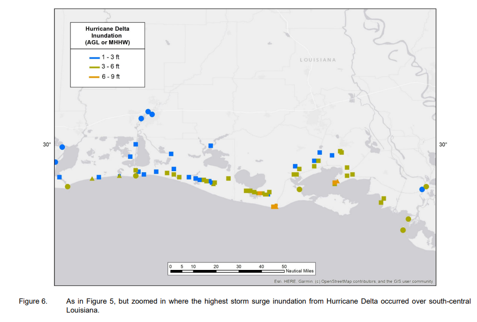

## Package

```{r setup, include=FALSE}
knitr::opts_chunk$set(echo = TRUE)
library(ggplot2)
library(readxl)
library(dplyr)
library(patchwork)
library(tidyverse)
library(reshape2)
library(ggrepel)
library(MASS)
library(drat)
library(httr)
library(jsonlite)
library(zoo)
library(mapview)
library(sf)
library(geosphere)
library(stringr)
library(ggcorrplot)
library(glmnet)
library(leaflet)
library(RColorBrewer)

```

# IA and study region load

```{r input excel}
FEMA_IA = read.csv("HousingAssistanceOwners.csv")
disaster_num_summary = read.csv("DisasterDeclarationsSummaries.csv")
```

```{r Get the Number of major hurricane}
hurricane_num = disaster_num_summary[disaster_num_summary$incidentType == "Hurricane",]
study_cases_num = unique(disaster_num_summary[disaster_num_summary$disasterNumber <= 4629 & disaster_num_summary$disasterNumber >= 4332 & disaster_num_summary$incidentType == "Hurricane" & disaster_num_summary$disasterType == "DR",]$disasterNumber)
study_cases_event = c()
study_cases_state = c()
number_cases = c()
year = c()

for(i in study_cases_num)
{
  study_cases_event  = c(study_cases_event,unique(disaster_num_summary[disaster_num_summary$disasterNumber == i,]$title)[1])
  study_cases_state = c(study_cases_state,unique(disaster_num_summary[disaster_num_summary$disasterNumber == i,]$state)[1])
  number_cases = c(number_cases,nrow(FEMA_IA[FEMA_IA$disasterNumber == i,]))
  temp_year = disaster_num_summary[disaster_num_summary$disasterNumber == i,]$declarationDate[1]
  year = c(year,unlist(strsplit(temp_year, "-"))[1])
}


study_events_all <- data.frame(disasterNumber = study_cases_num, event = study_cases_event, state = study_cases_state, number_cases = number_cases, year=year)

study_events <- subset(study_events_all,number_cases>0)
study_events <- subset(study_events,state != "VI" & state != "PR")
study_events <- subset(study_events,event != "TROPICAL STORM GITA")
study_events <- subset(study_events,event != "REMNANTS OF HURRICANE IDA")
study_events <- subset(study_events,event != "REMNANTS OF TROPICAL STORM FRED")
study_events <- subset(study_events,event != "HURRICANE IRMA - SEMINOLE TRIBE OF FLORIDA")
study_events <- subset(study_events,event != "HURRICANE ZETA")

write.csv(study_events,"study_regions/study_regions.csv", row.names = FALSE)
```

```{r Collect type1 and type2 houses from IA}
Data_housing = data.frame(disaster_number=integer(),county=character(),state=character(),approvedBetween10001And25000=integer(),approvedBetween25001AndMax=integer(),event_title=character(),year=integer())

for(i in study_events$disasterNumber)
{
  temp = FEMA_IA[FEMA_IA$disasterNumber == i,]
  temp_out = aggregate(cbind(approvedBetween10001And25000,approvedBetween25001AndMax)~disasterNumber+county+state, data = temp, FUN=sum)
  temp_out$event_title = study_events[study_events$disasterNumber == i,]$event
  temp_out$year = study_events[study_events$disasterNumber==i,]$year[1]
  Data_housing = rbind(Data_housing,temp_out)
}

names(Data_housing)[names(Data_housing) == "approvedBetween10001And25000"] <- "type1"
names(Data_housing)[names(Data_housing) == "approvedBetween25001AndMax"] <- "type2"
Data_housing <- subset(Data_housing,state != "VI" & state != "PR")
Data_housing$county = gsub("\\(|\\)","",as.character(Data_housing$county))

Data_housing[Data_housing$county == "La Salle Parish",]$county = "LaSalle Parish"
Data_housing = subset(Data_housing,county != "Statewide")

#extend data
Data_housing = rbind(Data_housing, c(4337,"Taylor County","FL",0,0,"HURRICANE IRMA",2017))
Data_housing = rbind(Data_housing, c(4337,"Madison County","FL",0,0,"HURRICANE IRMA",2017))
Data_housing = rbind(Data_housing, c(4337,"Lowndes County","GA",0,0,"HURRICANE IRMA",2017))
Data_housing = rbind(Data_housing, c(4337,"Echols County","GA",0,0,"HURRICANE IRMA",2017))
Data_housing = rbind(Data_housing, c(4337,"Ware County","GA",0,0,"HURRICANE IRMA",2017))
Data_housing = rbind(Data_housing, c(4337,"Clinch County","GA",0,0,"HURRICANE IRMA",2017))
Data_housing = rbind(Data_housing, c(4337,"Lanier County","GA",0,0,"HURRICANE IRMA",2017))
Data_housing = rbind(Data_housing, c(4337,"Atkinson County","GA",0,0,"HURRICANE IRMA",2017))
Data_housing = rbind(Data_housing, c(4337,"Bacon County","GA",0,0,"HURRICANE IRMA",2017))
Data_housing = rbind(Data_housing, c(4337,"Pierce County","GA",0,0,"HURRICANE IRMA",2017))
Data_housing = rbind(Data_housing, c(4337,"Brantley County","GA",0,0,"HURRICANE IRMA",2017))

Data_housing = rbind(Data_housing, c(4400,"Brantley County","GA",0,0,"HURRICANE MICHAEL",2018))
Data_housing = rbind(Data_housing, c(4400,"Colquitt County","GA",0,0,"HURRICANE MICHAEL",2018))
Data_housing = rbind(Data_housing, c(4400,"Dooly County","GA",0,0,"HURRICANE MICHAEL",2018))
Data_housing = rbind(Data_housing, c(4400,"Houston County","GA",0,0,"HURRICANE MICHAEL",2018))
Data_housing = rbind(Data_housing, c(4400,"Pulaski County","GA",0,0,"HURRICANE MICHAEL",2018))
Data_housing = rbind(Data_housing, c(4400,"Wilcox County","GA",0,0,"HURRICANE MICHAEL",2018))
Data_housing = rbind(Data_housing, c(4400,"Ben Hill County","GA",0,0,"HURRICANE MICHAEL",2018))
Data_housing = rbind(Data_housing, c(4400,"Dodge County","GA",0,0,"HURRICANE MICHAEL",2018))
Data_housing = rbind(Data_housing, c(4400,"Bleckley County","GA",0,0,"HURRICANE MICHAEL",2018))
Data_housing = rbind(Data_housing, c(4400,"Jefferson County","GA",0,0,"HURRICANE MICHAEL",2018))

Data_housing = rbind(Data_housing, c(4559,"Evangeline Parish","LA",0,0,"HURRICANE LAURA",2020))
Data_housing = rbind(Data_housing, c(4559,"De Soto Parish","LA",0,0,"HURRICANE LAURA",2020))
Data_housing = rbind(Data_housing, c(4559,"Red River Parish","LA",0,0,"HURRICANE LAURA",2020))
Data_housing = rbind(Data_housing, c(4559,"Bienville Parish","LA",0,0,"HURRICANE LAURA",2020))
Data_housing = rbind(Data_housing, c(4559,"Bossier Parish","LA",0,0,"HURRICANE LAURA",2020))
Data_housing = rbind(Data_housing, c(4559,"Webster Parish","LA",0,0,"HURRICANE LAURA",2020))
Data_housing = rbind(Data_housing, c(4559,"Claiborne Parish","LA",0,0,"HURRICANE LAURA",2020))

Data_housing = rbind(Data_housing, c(4570,"Evangeline Parish","LA",0,0,"HURRICANE DELTA",2020))
Data_housing = rbind(Data_housing, c(4570,"Avoyelles Parish","LA",0,0,"HURRICANE DELTA",2020))
Data_housing = rbind(Data_housing, c(4570,"Vernon Parish","LA",0,0,"HURRICANE DELTA",2020))


Data_housing = transform(Data_housing, type1 = as.numeric(type1), type2 = as.numeric(type2))

write.csv(Data_housing,"study_regions/Data_housing_FEMA.csv", row.names = FALSE)

```

# County info load

```{r all counites in us info}
uscounties_info = read.csv("uscounties_info.csv")
```

```{r load howeownership data}
AL_h = read_excel("Homeownership/AL.xlsx")
FL_h = read_excel("Homeownership/FL.xlsx")
GA_h = read_excel("Homeownership/GA.xlsx")
LA_h = read_excel("Homeownership/LA.xlsx")
MS_h = read_excel("Homeownership/MS.xlsx")
NC_h = read_excel("Homeownership/NC.xlsx")
SC_h = read_excel("Homeownership/SC.xlsx")
TX_h = read_excel("Homeownership/TX.xlsx")
```

# Population load

```{r load populationo data}
population_10_19 = read_excel("population/est2010-2019.xlsx")
population_10_19$county = str_replace(population_10_19$county, ".", "")
countyName_temp = str_split_fixed(population_10_19$county, ",", 2)[,1]
state_temp = str_split_fixed(population_10_19$county, ",", 2)[,2]
population_10_19$countyName = countyName_temp
population_10_19$state = state_temp
population_10_19 = subset(population_10_19,select=-c(county))
population_10_19 = population_10_19[,c(12,11,1,2,3,4,5,6,7,8,9,10)]
population_10_19$state = gsub( " ", "", population_10_19$state) 

population_20_21 = read_excel("population/est2020-2021.xlsx")
population_20_21$county = str_replace(population_20_21$state, ".", "")
countyName_temp = str_split_fixed(population_20_21$county, ",", 2)[,1]
state_temp = str_split_fixed(population_20_21$county, ",", 2)[,2]
population_20_21$countyName = countyName_temp
population_20_21$state = state_temp
population_20_21 = subset(population_20_21,select = c(countyName,state,`2020`,`2021`))
population_20_21$state = gsub( " ", "", population_20_21$state) 
```

# SVI load

```{r}
svi_2016 = read.csv("SVI/SVI2016_US_COUNTY.csv")
svi_2016 = subset(svi_2016,select = c(ST_ABBR,COUNTY,RPL_THEMES))
colnames(svi_2016)[3] = "SVI"
colnames(svi_2016)[1] = "state"
colnames(svi_2016)[2] = "countyName"
for(i in 1:nrow(svi_2016))
{
  if(svi_2016$state[i] == "LA")
  {
    svi_2016$countyName[i] = paste0(svi_2016$countyName[i]," Parish")
  }
  else
  {
    svi_2016$countyName[i] = paste0(svi_2016$countyName[i]," County")
  }
}

svi_2018 = read.csv("SVI/SVI2018_US_COUNTY.csv")
svi_2018 = subset(svi_2018,select = c(ST_ABBR,COUNTY,RPL_THEMES))
colnames(svi_2018)[3] = "SVI"
colnames(svi_2018)[1] = "state"
colnames(svi_2018)[2] = "countyName"
for(i in 1:nrow(svi_2018))
{
  if(svi_2018$state[i] == "LA")
  {
    svi_2018$countyName[i] = paste0(svi_2018$countyName[i]," Parish")
  }
  else
  {
    svi_2018$countyName[i] = paste0(svi_2018$countyName[i]," County")
  }
}

svi_2020 = read.csv("SVI/SVI2020_US_COUNTY.csv")
svi_2020 = subset(svi_2020,select = c(ST_ABBR,COUNTY,RPL_THEMES))
colnames(svi_2020)[3] = "SVI"
colnames(svi_2020)[1] = "state"
colnames(svi_2020)[2] = "countyName"
for(i in 1:nrow(svi_2020))
{
  if(svi_2020$state[i] == "LA")
  {
    svi_2020$countyName[i] = paste0(svi_2020$countyName[i]," Parish")
  }
  else
  {
    svi_2020$countyName[i] = paste0(svi_2020$countyName[i]," County")
  }
}
```

# HMW load

```{r load HWM data}
myvars = c("countyName", "stateName", "height_above_gnd")

f_Florence = read.csv("HWM/Florence.csv")
f_Florence = subset(f_Florence, height_above_gnd != "NA")
f_Florence = f_Florence [myvars]
f_Florence = f_Florence %>% group_by(countyName,stateName) %>% summarise(across(c(height_above_gnd), max))

f_Harvey = read.csv("HWM/Harvey.csv")
f_Harvey = subset(f_Harvey, height_above_gnd != "NA")
f_Harvey = f_Harvey [myvars]
f_Harvey = f_Harvey %>% group_by(countyName,stateName) %>% summarise(across(c(height_above_gnd), max))

f_Ida = read.csv("HWM/Ida.csv")
f_Ida = subset(f_Ida, height_above_gnd != "NA")
f_Ida = f_Ida [myvars]
f_Ida = f_Ida %>% group_by(countyName,stateName) %>% summarise(across(c(height_above_gnd), max))

f_Irma = read.csv("HWM/Irma.csv")
f_Irma = subset(f_Irma, height_above_gnd != "NA")
f_Irma = f_Irma [myvars]
f_Irma = f_Irma %>% group_by(countyName,stateName) %>% summarise(across(c(height_above_gnd), max))

f_Laura = read.csv("HWM/Laura.csv")
f_Laura = subset(f_Laura, height_above_gnd != "NA")
f_Laura = f_Laura [myvars]
f_Laura = f_Laura %>% group_by(countyName,stateName) %>% summarise(across(c(height_above_gnd), max))

f_Delta = read.csv("HWM/Delta.csv")
f_Delta = subset(f_Delta, height_above_gnd != "NA")
f_Delta = f_Delta [myvars]
f_Delta = f_Delta %>% group_by(countyName,stateName) %>% summarise(across(c(height_above_gnd), max))

f_Sally = read.csv("HWM/Sally.csv")
f_Sally = subset(f_Sally, height_above_gnd != "NA")
f_Sally = f_Sally [myvars]
f_Sally = f_Sally %>% group_by(countyName,stateName) %>% summarise(across(c(height_above_gnd), max))

#f_Zeta = read.csv("HWM/Zeta.csv")
#f_Zeta = subset(f_Zeta, height_above_gnd != "NA")

f_Michael = read.csv("HWM/Michael.csv")
f_Michael = subset(f_Michael, height_above_gnd != "NA")
f_Michael = f_Michael [myvars]
f_Michael = f_Michael %>% group_by(countyName,stateName) %>% summarise(across(c(height_above_gnd), max))
```

# Hurricane track load

```{r change HURDAT2 data txt to csv (hurricane)}
csv = read.csv("Hurricane_track/hurdat2021.txt", header=F, as.is=T)

names(csv) = c("DATE", "TIME_UTC", "POINT_TYPE", "STATUS", 
	"LATITUDE", "LONGITUDE", "WINDSPEED_KT", "PRESURE_MB", 
	"NE_34_KT", "SE_34_KT", "NW_34_KT", "SW_34_KT",
	"NE_50_KT", "SE_50_KT", "NW_50_KT", "SW_50_KT",
	"NE_64_KT", "SE_64_KT", "NW_64_KT", "SW_64_KT","max_KT")

panel = cbind(HID = NA, HNAME = NA, csv)

panel$HID = ifelse(grepl("AL|EP|CP", panel$DATE), panel$DATE, NA)
panel$HNAME = ifelse(grepl("AL|EP|CP", panel$DATE), panel$TIME_UTC, NA)
panel$HID = na.locf(panel$HID)
panel$HNAME = na.locf(panel$HNAME)
panel = panel[!grepl("AL|EP|CP", panel$DATE), ]

panel$LATITUDE = trimws(panel$LATITUDE)
panel$LONGITUDE = trimws(panel$LONGITUDE)
panel$LATITUDE = ifelse(grepl("S", panel$LATITUDE), paste0("-", panel$LATITUDE), panel$LATITUDE)
panel$LONGITUDE = ifelse(grepl("W", panel$LONGITUDE), paste0("-", panel$LONGITUDE), panel$LONGITUDE)
panel$LATITUDE = as.numeric(sub("N|S", "", panel$LATITUDE))
panel$LONGITUDE = as.numeric(sub("E|W", "", panel$LONGITUDE))
panel$STATUS = trimws(panel$STATUS)
panel$DECADE = paste0(substr(panel$DATE, 1, 3), "0")

panel = subset(panel,select = -c(POINT_TYPE))
panel$HNAME<-gsub(" ","",as.character(panel$HNAME))
panel = panel[panel$HNAME != "UNNAMED",]
panel$TIME_UTC=sub(" ","",as.character(panel$TIME_UTC))

write.csv(panel, "Hurricane_track/hurdat2021.csv", row.names=F)
```

# County + demand + lat,long

```{r county+demand+lat,long}
Data_all = Data_housing

longitude = c()
latitude = c()

for(i in 1:nrow(Data_all))
{
  long_name = uscounties_info[uscounties_info$county_full == Data_all$county[i],]
  long = long_name[long_name$state_id == Data_all$state[i],]$lng[1]
  longitude = c(longitude,long)

  lat_name = uscounties_info[uscounties_info$county_full == Data_all$county[i],]
  lat = lat_name[lat_name$state_id == Data_all$state[i],]$lat[1]
  latitude = c(latitude,lat)
}

Data_all$longitude = longitude
Data_all$latitude = latitude
```

```{r Study event track data}
track_Harvey = panel[panel$HNAME == "HARVEY" & panel$HID == "AL092017",]
track_Irma = panel[panel$HNAME == "IRMA" & panel$HID == "AL112017",]
track_Florence = panel[panel$HNAME == "FLORENCE" & panel$HID == "AL062018",]
track_Michael = panel[panel$HNAME == "MICHAEL" & panel$HID == "AL142018",]
track_Laura = panel[panel$HNAME == "LAURA" & panel$HID == "AL132020",]
track_Sally = panel[panel$HNAME == "SALLY" & panel$HID == "AL192020",]
track_Delta = panel[panel$HNAME == "DELTA" & panel$HID == "AL262020",]
track_Ida = panel[panel$HNAME == "IDA" & panel$HID == "AL092021",]

```

# Draw function

```{r draw a track on a map}
draw_track_map = function(A)
{
  mapview(A, xcol = "LONGITUDE", ycol = "LATITUDE", zcol = "DATE", crs = 4269, grid = FALSE)
}
```

```{r sellect the study region from county shape data}
us_counties = read_sf("US_conties_shp/cb_2018_us_county_500k.shp")
us_study_counties = us_counties[us_counties$STATEFP == "01"    #AL
                          | us_counties$STATEFP == "12"  #FL
                          | us_counties$STATEFP == "13"  #GA
                          | us_counties$STATEFP == "22"  #LA
                          | us_counties$STATEFP == "28"  #MS
                          | us_counties$STATEFP == "37"  #NC
                          | us_counties$STATEFP == "45"  #SC
                          | us_counties$STATEFP == "48",]#TX

us_study_counties = subset(us_study_counties, select = c(STATEFP,NAME,geometry))

for(i in 1:nrow(us_study_counties))
{
  if(us_study_counties$STATEFP[i] == "22")
  {
    us_study_counties$NAME[i] = paste(us_study_counties$NAME[i],"Parish")
  }
  else
  {
    us_study_counties$NAME[i] = paste(us_study_counties$NAME[i],"County")
  }
  
  if(us_study_counties$STATEFP[i] == "01"){us_study_counties$STATEFP[i] = "AL"}
  if(us_study_counties$STATEFP[i] == "12"){us_study_counties$STATEFP[i] = "FL"}
  if(us_study_counties$STATEFP[i] == "13"){us_study_counties$STATEFP[i] = "GA"}
  if(us_study_counties$STATEFP[i] == "22"){us_study_counties$STATEFP[i] = "LA"}
  if(us_study_counties$STATEFP[i] == "28"){us_study_counties$STATEFP[i] = "MS"}
  if(us_study_counties$STATEFP[i] == "37"){us_study_counties$STATEFP[i] = "NC"}
  if(us_study_counties$STATEFP[i] == "45"){us_study_counties$STATEFP[i] = "SC"}
  if(us_study_counties$STATEFP[i] == "48"){us_study_counties$STATEFP[i] = "TX"}
}


```

# Get distance function

```{r get wind and distacne function}
wind_distance <- function(track,Data_housing,start_node) 
{
  for(i in 0:8)
  {
    node = start_node+i
    lat_n = track$LATITUDE[node]
    log_n = track$LONGITUDE[node]
    node_county_distance = c() 
    for(j in 1:nrow(Data_housing))
    {
      lat_c = Data_housing$latitude[j]
      log_c = Data_housing$longitude[j]
      #transfer to Nautical mile
      temp_dis = distm(c(log_n, lat_n), c(log_c, lat_c), fun = distHaversine)[,1]*0.868976/1609
      node_county_distance = c(node_county_distance,temp_dis)
      
      #wind
      #First, direction of the county
      if(lat_c > lat_n)
      {
        if(log_c > log_n)
        {
          wind_range1 = track$NE_34_KT[node]
          wind_range2 = track$NE_50_KT[node]
          wind_range3 = track$NE_64_KT[node]
          if(temp_dis <= wind_range3)
          {
            Data_housing$wind_64_up[j] = Data_housing$wind_64_up[j] + 1 
          }
          else
          {
            if(temp_dis <= wind_range2)
            {
              Data_housing$wind_50_64[j] = Data_housing$wind_50_64[j] + 1
            }
            else
            {
              if(temp_dis <= wind_range1)
              {
                Data_housing$wind_34_50[j] = Data_housing$wind_34_50[j] + 1
              }
              else
              {
                Data_housing$wind_34_down[j] = Data_housing$wind_34_down[j] + 1
              }
            }
          }
        }
        else
        {
          wind_range1 = track$NW_34_KT[node]
          wind_range2 = track$NW_50_KT[node]
          wind_range3 = track$NW_64_KT[node]
          if(temp_dis <= wind_range3)
          {
            Data_housing$wind_64_up[j] = Data_housing$wind_64_up[j] + 1 
          }
          else
          {
            if(temp_dis <= wind_range2)
            {
              Data_housing$wind_50_64[j] = Data_housing$wind_50_64[j] + 1
            }
            else
            {
              if(temp_dis <= wind_range1)
              {
                Data_housing$wind_34_50[j] = Data_housing$wind_34_50[j] + 1
              }
              else
              {
                Data_housing$wind_34_down[j] = Data_housing$wind_34_down[j] + 1
              }
            }
          }
        }
      }
      else
      {
        if(log_c > log_n)
        {
          wind_range1 = track$SE_34_KT[node]
          wind_range2 = track$SE_50_KT[node]
          wind_range3 = track$SE_64_KT[node]
          if(temp_dis <= wind_range3)
          {
            Data_housing$wind_64_up[j] = Data_housing$wind_64_up[j] + 1 
          }
          else
          {
            if(temp_dis <= wind_range2)
            {
              Data_housing$wind_50_64[j] = Data_housing$wind_50_64[j] + 1
            }
            else
            {
              if(temp_dis <= wind_range1)
              {
                Data_housing$wind_34_50[j] = Data_housing$wind_34_50[j] + 1
              }
              else
              {
                Data_housing$wind_34_down[j] = Data_housing$wind_34_down[j] + 1
              }
            }
          }
        }
        else
        {
          wind_range1 = track$SW_34_KT[node]
          wind_range2 = track$SW_50_KT[node]
          wind_range3 = track$SW_64_KT[node]
          if(temp_dis <= wind_range3)
          {
            Data_housing$wind_64_up[j] = Data_housing$wind_64_up[j] + 1 
          }
          else
          {
            if(temp_dis <= wind_range2)
            {
              Data_housing$wind_50_64[j] = Data_housing$wind_50_64[j] + 1
            }
            else
            {
              if(temp_dis <= wind_range1)
              {
                Data_housing$wind_34_50[j] = Data_housing$wind_34_50[j] + 1
              }
              else
              {
                Data_housing$wind_34_down[j] = Data_housing$wind_34_down[j] + 1
              }
            }
          }
        }
      }
    }
    Data_housing = cbind(Data_housing,node_county_distance)
    colnames(Data_housing)[colnames(Data_housing) == "node_county_distance"] = paste0("node",i+1)
  }
  return(Data_housing)
}
```

# Harvey map draw

```{r Harvey drack and demand, distance to node, windspeed}
# Harvey
Data_housing_Harvey = Data_all[Data_housing$event_title == "HURRICANE HARVEY",]
demand2 = c()
demand1 = c()
for(i in 1:nrow(us_study_counties))
{
  if(any(us_study_counties$STATEFP[i] == Data_housing_Harvey$state))
  {
    demand1 = c(demand1,Data_housing_Harvey[Data_housing_Harvey$county == us_study_counties$NAME[i] & Data_housing_Harvey$state == us_study_counties$STATEFP[i],]$type1[1])
    demand2 = c(demand2,Data_housing_Harvey[Data_housing_Harvey$county == us_study_counties$NAME[i] & Data_housing_Harvey$state == us_study_counties$STATEFP[i],]$type2[1])
  }
  else
  {
    demand1 = c(demand1,NA)
    demand2 = c(demand2,NA)
  }
}

us_study_counties$Harvey1 = demand1
us_study_counties$Harvey2 = demand2

##collect Harvey Time(distance) , wind and side data

start_node = which(track_Harvey$TIME_UTC == "0300")

wind_34_down = rep(0, nrow(Data_housing_Harvey))
wind_34_50 = rep(0, nrow(Data_housing_Harvey))
wind_50_64 = rep(0, nrow(Data_housing_Harvey))
wind_64_up = rep(0, nrow(Data_housing_Harvey))

Data_housing_Harvey$wind_34_down = wind_34_down
Data_housing_Harvey$wind_34_50 = wind_34_50
Data_housing_Harvey$wind_50_64 = wind_50_64
Data_housing_Harvey$wind_64_up = wind_64_up

Data_housing_Harvey = wind_distance(track_Harvey,Data_housing_Harvey,start_node)
```

```{r collect homeownership, svi, population, HMW}
SVI = c()
population = c()
homeownership_rate = c()
hwm = c()

for(i in 1:nrow(Data_housing_Harvey))
{
  svi_temp = svi_2016[svi_2016$countyName == Data_housing_Harvey$county[i] & svi_2016$state == Data_housing_Harvey$state[i],]$SVI[1]
  SVI = c(SVI,svi_temp)
  
  population_temp = population_10_19[population_10_19$state == "Texas" & population_10_19$countyName == Data_housing_Harvey$county[i],]$`2017`[1]
  population = c(population,population_temp)
  
  homeownership_rate_temp = TX_h[TX_h$Name == Data_housing_Harvey$county[i],]$`2017`[1]
  homeownership_rate = c(homeownership_rate,homeownership_rate_temp)
  
  hwm_temp = f_Harvey[f_Harvey$stateName == Data_housing_Harvey$state[i] & f_Harvey$countyName == Data_housing_Harvey$county[i],]$height_above_gnd[1]
  hwm = c(hwm,hwm_temp)
}

Data_housing_Harvey$SVI = SVI
Data_housing_Harvey$population = population
Data_housing_Harvey$homeownership_rate = homeownership_rate
Data_housing_Harvey$hwm = hwm
Data_housing_Harvey$wind_50_up = Data_housing_Harvey$wind_50_64 + Data_housing_Harvey$wind_64_up

Data_housing_Harvey[is.na(Data_housing_Harvey)] = 0
```

```{r draw Harvey demand and track}
mapview(us_study_counties,zcol = "Harvey1") + draw_track_map(track_Harvey)
```

```{r draw wind speed duration and hwm}
temp = data.frame(longitude = Data_housing_Harvey$longitude, latitude = Data_housing_Harvey$latitude, wind_duration_Harvey = Data_housing_Harvey$wind_50_up, Harvey_HWM = Data_housing_Harvey$hwm)

Harvey_wind_duration = mapview(temp, xcol = "longitude", ycol = "latitude", zcol = "wind_duration_Harvey", legend = TRUE, crs = 4269, grid = FALSE, layer3.name = "wind_duration_Harvey")
Harvey_wind_duration

Harvey_HWM = mapview(temp, xcol = "longitude", ycol = "latitude", zcol = "Harvey_HWM", legend = TRUE, crs = 4269, grid = FALSE, layer3.name = "hwm_Harvey")
Harvey_HWM
rm(temp)
```

{width="690"}


# Irma map draw

```{r Irma drack and demand, distance to node, windspeed}
# Irma
Data_housing_Irma = Data_all[Data_housing$event_title == "HURRICANE IRMA",]
demand2 = c()
demand1 = c()
for(i in 1:nrow(us_study_counties))
{
  demand1 = c(demand1,Data_housing_Irma[Data_housing_Irma$county == us_study_counties$NAME[i] & Data_housing_Irma$state == us_study_counties$STATEFP[i],]$type1[1])
  demand2 = c(demand2,Data_housing_Irma[Data_housing_Irma$county == us_study_counties$NAME[i] & Data_housing_Irma$state == us_study_counties$STATEFP[i],]$type2[1])
}

us_study_counties$Irma1 = demand1
us_study_counties$Irma2 = demand2

##collect Irma Time(distance) , wind and side data

start_node = which(track_Irma$TIME_UTC == "1200" & track_Irma$DATE == "20170910")

wind_34_down = rep(0, nrow(Data_housing_Irma))
wind_34_50 = rep(0, nrow(Data_housing_Irma))
wind_50_64 = rep(0, nrow(Data_housing_Irma))
wind_64_up = rep(0, nrow(Data_housing_Irma))

Data_housing_Irma$wind_34_down = wind_34_down
Data_housing_Irma$wind_34_50 = wind_34_50
Data_housing_Irma$wind_50_64 = wind_50_64
Data_housing_Irma$wind_64_up = wind_64_up

Data_housing_Irma = wind_distance(track_Irma,Data_housing_Irma,start_node)
```

```{r collect homeownership, svi, population, HMW}
SVI = c()
population = c()
homeownership_rate = c()
hwm = c()

for(i in 1:nrow(Data_housing_Irma))
{
  svi_temp = svi_2016[svi_2016$countyName == Data_housing_Irma$county[i] & svi_2016$state == Data_housing_Irma$state[i],]$SVI[1]
  SVI = c(SVI,svi_temp)
  
  if(Data_housing_Irma$state[i] == "FL")
  {
    population_temp = population_10_19[population_10_19$state == "Florida" & population_10_19$countyName == Data_housing_Irma$county[i],]$`2017`[1]
    population = c(population,population_temp)
    
    homeownership_rate_temp = FL_h[FL_h$Name == Data_housing_Irma$county[i],]$`2017`[1]
    homeownership_rate = c(homeownership_rate,homeownership_rate_temp)
  }
  else if(Data_housing_Irma$state[i] == "GA")
  {
    population_temp = population_10_19[population_10_19$state == "Georgia" & population_10_19$countyName == Data_housing_Irma$county[i],]$`2017`[1]
    population = c(population,population_temp)
    
    homeownership_rate_temp = GA_h[GA_h$Name == Data_housing_Irma$county[i],]$`2017`[1]
    homeownership_rate = c(homeownership_rate,homeownership_rate_temp)
  }
  else if(Data_housing_Irma$state[i] == "MS")
  {
    population_temp = population_10_19[population_10_19$state == "Mississippi" & population_10_19$countyName == Data_housing_Irma$county[i],]$`2017`[1]
    population = c(population,population_temp)
    
    homeownership_rate_temp = MS_h[MS_h$Name == Data_housing_Irma$county[i],]$`2017`[1]
    homeownership_rate = c(homeownership_rate,homeownership_rate_temp)
  }
  else if(Data_housing_Irma$state[i] == "SC")
  {
    population_temp = population_10_19[population_10_19$state == "SouthCarolina" & population_10_19$countyName == Data_housing_Irma$county[i],]$`2017`[1]
    population = c(population,population_temp)
    
    homeownership_rate_temp = SC_h[SC_h$Name == Data_housing_Irma$county[i],]$`2017`[1]
    homeownership_rate = c(homeownership_rate,homeownership_rate_temp)
  }
  else if(Data_housing_Irma$state[i] == "TX")
  {
    population_temp = population_10_19[population_10_19$state == "Texas" & population_10_19$countyName == Data_housing_Irma$county[i],]$`2017`[1]
    population = c(population,population_temp)
    
    homeownership_rate_temp = TX_h[TX_h$Name == Data_housing_Irma$county[i],]$`2017`[1]
    homeownership_rate = c(homeownership_rate,homeownership_rate_temp)
  }

  hwm_temp = f_Irma[f_Irma$stateName == Data_housing_Irma$state[i] & f_Irma$countyName == Data_housing_Irma$county[i],]$height_above_gnd[1]
  hwm = c(hwm,hwm_temp)
}

Data_housing_Irma$SVI = SVI
Data_housing_Irma$population = population
Data_housing_Irma$homeownership_rate = homeownership_rate
Data_housing_Irma$hwm = hwm
Data_housing_Irma$wind_50_up = Data_housing_Irma$wind_50_64 + Data_housing_Irma$wind_64_up

Data_housing_Irma[is.na(Data_housing_Irma)] = 0
```

```{r }
mapview(us_study_counties,zcol = "Irma1") + draw_track_map(track_Irma)
```

```{r draw wind speed duration and hwm}
temp = data.frame(longitude = Data_housing_Irma$longitude, latitude = Data_housing_Irma$latitude, wind_duration_Irma  = Data_housing_Irma$wind_50_up, Irma_HWM = Data_housing_Irma$hwm)

Irma_wind_duration = mapview(temp, xcol = "longitude", ycol = "latitude", zcol = "wind_duration_Irma", legend = TRUE, crs = 4269, grid = FALSE, layer3.name = "wind_duration_Irma")
Irma_wind_duration

Irma_HWM = mapview(temp, xcol = "longitude", ycol = "latitude", zcol = "Irma_HWM", legend = TRUE, crs = 4269, grid = FALSE, layer3.name = "hwm_Irma")
Irma_HWM
rm(temp)
```

{width="689"}


# Florence map draw

```{r}
# FLORENCE
Data_housing_Florence = Data_all[Data_housing$event_title == "HURRICANE FLORENCE",]
demand2 = c()
demand1 = c()
for(i in 1:nrow(us_study_counties))
{
  demand1 = c(demand1,Data_housing_Florence[Data_housing_Florence$county == us_study_counties$NAME[i] & Data_housing_Florence$state == us_study_counties$STATEFP[i],]$type1[1])
  demand2 = c(demand2,Data_housing_Florence[Data_housing_Florence$county == us_study_counties$NAME[i] & Data_housing_Florence$state == us_study_counties$STATEFP[i],]$type2[1])
}

us_study_counties$Florence1 = demand1
us_study_counties$Florence2 = demand2

##collect FLORENCE Time(distance) , wind and side data

start_node = which(track_Florence$TIME_UTC == "1115" & track_Florence$DATE == "20180914")

wind_34_down = rep(0, nrow(Data_housing_Florence))
wind_34_50 = rep(0, nrow(Data_housing_Florence))
wind_50_64 = rep(0, nrow(Data_housing_Florence))
wind_64_up = rep(0, nrow(Data_housing_Florence))

Data_housing_Florence$wind_34_down = wind_34_down
Data_housing_Florence$wind_34_50 = wind_34_50
Data_housing_Florence$wind_50_64 = wind_50_64
Data_housing_Florence$wind_64_up = wind_64_up

Data_housing_Florence = wind_distance(track_Florence,Data_housing_Florence,start_node)

```

```{r collect homeownership, svi, population, HMW}
SVI = c()
population = c()
homeownership_rate = c()
hwm = c()

for(i in 1:nrow(Data_housing_Florence))
{
  svi_temp = svi_2018[svi_2018$countyName == Data_housing_Florence$county[i] & svi_2018$state == Data_housing_Florence$state[i],]$SVI[1]
  SVI = c(SVI,svi_temp)
  
  if(Data_housing_Florence$state[i] == "NC")
  {
    population_temp = population_10_19[population_10_19$state == "NorthCarolina" & population_10_19$countyName == Data_housing_Florence$county[i],]$`2018`[1]
    population = c(population,population_temp)
    
    homeownership_rate_temp = NC_h[NC_h$Name == Data_housing_Florence$county[i],]$`2018`[1]
    homeownership_rate = c(homeownership_rate,homeownership_rate_temp)
  }
  else if(Data_housing_Florence$state[i] == "SC")
  {
    population_temp = population_10_19[population_10_19$state == "SouthCarolina" & population_10_19$countyName == Data_housing_Florence$county[i],]$`2018`[1]
    population = c(population,population_temp)
    
    homeownership_rate_temp = SC_h[SC_h$Name == Data_housing_Florence$county[i],]$`2018`[1]
    homeownership_rate = c(homeownership_rate,homeownership_rate_temp)
  }


  hwm_temp = f_Florence[f_Florence$stateName == Data_housing_Florence$state[i] & f_Florence$countyName == Data_housing_Florence$county[i],]$height_above_gnd[1]
  hwm = c(hwm,hwm_temp)
}

Data_housing_Florence$SVI = SVI
Data_housing_Florence$population = population
Data_housing_Florence$homeownership_rate = homeownership_rate
Data_housing_Florence$hwm = hwm
Data_housing_Florence$wind_50_up = Data_housing_Florence$wind_50_64 + Data_housing_Florence$wind_64_up

Data_housing_Florence[is.na(Data_housing_Florence)] = 0

```

```{r }
mapview(us_study_counties,zcol = "Florence1") + draw_track_map(track_Florence)
```

```{r draw wind speed duration and hwm}
temp = data.frame(longitude = Data_housing_Florence$longitude, latitude = Data_housing_Florence$latitude, wind_duration_Florence = Data_housing_Florence$wind_50_up, Florence_HWM = Data_housing_Florence$hwm)

Florence_wind_duration = mapview(temp, xcol = "longitude", ycol = "latitude", zcol = "wind_duration_Florence", legend = TRUE, crs = 4269, grid = FALSE, layer3.name = "wind_duration_Florence")
Florence_wind_duration

Florence_HWM = mapview(temp, xcol = "longitude", ycol = "latitude", zcol = "Florence_HWM", legend = TRUE, crs = 4269, grid = FALSE, layer3.name = "hwm_Florence")
Florence_HWM
rm(temp)
```


# Michael map draw

```{r}
# MICHAEL
Data_housing_Michael = Data_all[Data_housing$event_title == "HURRICANE MICHAEL",]
demand2 = c()
demand1 = c()
for(i in 1:nrow(us_study_counties))
{
  demand1 = c(demand1,Data_housing_Michael[Data_housing_Michael$county == us_study_counties$NAME[i] & Data_housing_Michael$state == us_study_counties$STATEFP[i],]$type1[1])
  demand2 = c(demand2,Data_housing_Michael[Data_housing_Michael$county == us_study_counties$NAME[i] & Data_housing_Michael$state == us_study_counties$STATEFP[i],]$type2[1])
}

us_study_counties$Michael1 = demand1
us_study_counties$Michael2 = demand2

##collect MICHAEL Time(distance) , wind and side data

start_node = which(track_Michael$TIME_UTC == "1730" & track_Michael$DATE == "20181010")

wind_34_down = rep(0, nrow(Data_housing_Michael))
wind_34_50 = rep(0, nrow(Data_housing_Michael))
wind_50_64 = rep(0, nrow(Data_housing_Michael))
wind_64_up = rep(0, nrow(Data_housing_Michael))

Data_housing_Michael$wind_34_down = wind_34_down
Data_housing_Michael$wind_34_50 = wind_34_50
Data_housing_Michael$wind_50_64 = wind_50_64
Data_housing_Michael$wind_64_up = wind_64_up

Data_housing_Michael = wind_distance(track_Michael,Data_housing_Michael,start_node)
```

```{r collect homeownership, svi, population, HMW}
SVI = c()
population = c()
homeownership_rate = c()
hwm = c()

for(i in 1:nrow(Data_housing_Michael))
{
  svi_temp = svi_2018[svi_2018$countyName == Data_housing_Michael$county[i] & svi_2018$state == Data_housing_Michael$state[i],]$SVI[1]
  SVI = c(SVI,svi_temp)
  
  if(Data_housing_Michael$state[i] == "FL")
  {
    population_temp = population_10_19[population_10_19$state == "Florida" & population_10_19$countyName == Data_housing_Michael$county[i],]$`2018`[1]
    population = c(population,population_temp)
    
    homeownership_rate_temp = FL_h[FL_h$Name == Data_housing_Michael$county[i],]$`2018`[1]
    homeownership_rate = c(homeownership_rate,homeownership_rate_temp)
  }
  else if(Data_housing_Michael$state[i] == "GA")
  {
    population_temp = population_10_19[population_10_19$state == "Georgia" & population_10_19$countyName == Data_housing_Michael$county[i],]$`2018`[1]
    population = c(population,population_temp)
    
    homeownership_rate_temp = GA_h[GA_h$Name == Data_housing_Michael$county[i],]$`2017`[1]
    homeownership_rate = c(homeownership_rate,homeownership_rate_temp)
  }


  hwm_temp = f_Michael[f_Michael$stateName == Data_housing_Michael$state[i] & f_Michael$countyName == Data_housing_Michael$county[i],]$height_above_gnd[1]
  hwm = c(hwm,hwm_temp)
}

Data_housing_Michael$SVI = SVI
Data_housing_Michael$population = population
Data_housing_Michael$homeownership_rate = homeownership_rate
Data_housing_Michael$hwm = hwm
Data_housing_Michael$wind_50_up = Data_housing_Michael$wind_50_64 + Data_housing_Michael$wind_64_up

Data_housing_Michael[is.na(Data_housing_Michael)] = 0

```

```{r }
mapview(us_study_counties,zcol = "Michael1") + draw_track_map(track_Michael)
```

```{r draw wind speed duration and hwm}
temp = data.frame(longitude = Data_housing_Michael$longitude, latitude = Data_housing_Michael$latitude, wind_duration_Michael = Data_housing_Michael$wind_50_up, Michael_HWM = Data_housing_Michael$hwm)

Michael_wind_duration = mapview(temp, xcol = "longitude", ycol = "latitude", zcol = "wind_duration_Michael", legend = TRUE, crs = 4269, grid = FALSE, layer3.name = "wind_duration_Michael")
Michael_wind_duration

Michael_HWM = mapview(temp, xcol = "longitude", ycol = "latitude", zcol = "Michael_HWM", legend = TRUE, crs = 4269, grid = FALSE, layer3.name = "hwm_Michael")
Michael_HWM
rm(temp)
```

{width="632"}


# Laura map draw

```{r}
# LAURA
Data_housing_Laura = Data_all[Data_housing$event_title == "HURRICANE LAURA",]
demand2 = c()
demand1 = c()
for(i in 1:nrow(us_study_counties))
{
  demand1 = c(demand1,Data_housing_Laura[Data_housing_Laura$county == us_study_counties$NAME[i] & Data_housing_Laura$state == us_study_counties$STATEFP[i],]$type1[1])
  demand2 = c(demand2,Data_housing_Laura[Data_housing_Laura$county == us_study_counties$NAME[i] & Data_housing_Laura$state == us_study_counties$STATEFP[i],]$type2[1])
}

us_study_counties$Laura1 = demand1
us_study_counties$Laura2 = demand2

##collect LAURA Time(distance) , wind and side data

start_node = which(track_Laura$TIME_UTC == "0600" & track_Laura$DATE == "20200827")

wind_34_down = rep(0, nrow(Data_housing_Laura))
wind_34_50 = rep(0, nrow(Data_housing_Laura))
wind_50_64 = rep(0, nrow(Data_housing_Laura))
wind_64_up = rep(0, nrow(Data_housing_Laura))

Data_housing_Laura$wind_34_down = wind_34_down
Data_housing_Laura$wind_34_50 = wind_34_50
Data_housing_Laura$wind_50_64 = wind_50_64
Data_housing_Laura$wind_64_up = wind_64_up


Data_housing_Laura = wind_distance(track_Laura,Data_housing_Laura,start_node)
```

```{r collect homeownership, svi, population, HMW}
SVI = c()
population = c()
homeownership_rate = c()
hwm = c()

for(i in 1:nrow(Data_housing_Laura))
{
  svi_temp = svi_2020[svi_2020$countyName == Data_housing_Laura$county[i] & svi_2020$state == Data_housing_Laura$state[i],]$SVI[1]
  SVI = c(SVI,svi_temp)
  
  if(Data_housing_Laura$state[i] == "LA")
  {
    population_temp = population_20_21[population_20_21$state == "Louisiana" & population_20_21$countyName == Data_housing_Laura$county[i],]$`2020`[1]
    population = c(population,population_temp)
    
    homeownership_rate_temp = LA_h[LA_h$Name == Data_housing_Laura$county[i],]$`2020`[1]
    homeownership_rate = c(homeownership_rate,homeownership_rate_temp)
  }

  hwm_temp = f_Laura[f_Laura$stateName == Data_housing_Laura$state[i] & f_Laura$countyName == Data_housing_Laura$county[i],]$height_above_gnd[1]
  hwm = c(hwm,hwm_temp)
}

Data_housing_Laura$SVI = SVI
Data_housing_Laura$population = population
Data_housing_Laura$homeownership_rate = homeownership_rate
Data_housing_Laura$hwm = hwm
Data_housing_Laura$wind_50_up = Data_housing_Laura$wind_50_64 + Data_housing_Laura$wind_64_up

Data_housing_Laura[is.na(Data_housing_Laura)] = 0
```

```{r }
mapview(us_study_counties,zcol = "Laura1") + draw_track_map(track_Laura)
```

```{r draw wind speed duration and hwm}
temp = data.frame(longitude = Data_housing_Laura$longitude, latitude = Data_housing_Laura$latitude, wind_duration_Laura = Data_housing_Laura$wind_50_up, Laura_HWM = Data_housing_Laura$hwm)

Laura_wind_duration = mapview(temp, xcol = "longitude", ycol = "latitude", zcol = "wind_duration_Laura", legend = TRUE, crs = 4269, grid = FALSE, layer3.name = "wind_duration_Laura")
Laura_wind_duration

Laura_HWM = mapview(temp, xcol = "longitude", ycol = "latitude", zcol = "Laura_HWM", legend = TRUE, crs = 4269, grid = FALSE, layer3.name = "hwm_Laura")
Laura_HWM
rm(temp)
```


# Sally map draw

```{r }
# SALLY
Data_housing_Sally = Data_all[Data_housing$event_title == "HURRICANE SALLY",]
demand2 = c()
demand1 = c()
for(i in 1:nrow(us_study_counties))
{
  demand1 = c(demand1,Data_housing_Sally[Data_housing_Sally$county == us_study_counties$NAME[i] & Data_housing_Sally$state == us_study_counties$STATEFP[i],]$type1[1])
  demand2 = c(demand2,Data_housing_Sally[Data_housing_Sally$county == us_study_counties$NAME[i] & Data_housing_Sally$state == us_study_counties$STATEFP[i],]$type2[1])
}

us_study_counties$Sally1 = demand1
us_study_counties$Sally2 = demand2

##collect SALLY Time(distance) , wind and side data

start_node = which(track_Sally$TIME_UTC == "0945" & track_Sally$DATE == "20200916")

wind_34_down = rep(0, nrow(Data_housing_Sally))
wind_34_50 = rep(0, nrow(Data_housing_Sally))
wind_50_64 = rep(0, nrow(Data_housing_Sally))
wind_64_up = rep(0, nrow(Data_housing_Sally))

Data_housing_Sally$wind_34_down = wind_34_down
Data_housing_Sally$wind_34_50 = wind_34_50
Data_housing_Sally$wind_50_64 = wind_50_64
Data_housing_Sally$wind_64_up = wind_64_up

Data_housing_Sally = wind_distance(track_Sally,Data_housing_Sally,start_node)
```

```{r collect homeownership, svi, population, HMW}
SVI = c()
population = c()
homeownership_rate = c()
hwm = c()

for(i in 1:nrow(Data_housing_Sally))
{
  svi_temp = svi_2020[svi_2020$countyName == Data_housing_Sally$county[i] & svi_2020$state == Data_housing_Sally$state[i],]$SVI[1]
  SVI = c(SVI,svi_temp)
  
  if(Data_housing_Sally$state[i] == "AL")
  {
    population_temp = population_20_21[population_20_21$state == "Alabama" & population_20_21$countyName == Data_housing_Sally$county[i],]$`2020`[1]
    population = c(population,population_temp)
    
    homeownership_rate_temp = AL_h[AL_h$Name == Data_housing_Sally$county[i],]$`2020`[1]
    homeownership_rate = c(homeownership_rate,homeownership_rate_temp)
  }
  else if(Data_housing_Sally$state[i] == "FL")
  {
    population_temp = population_20_21[population_20_21$state == "Florida" & population_20_21$countyName == Data_housing_Sally$county[i],]$`2020`[1]
    population = c(population,population_temp)
    
    homeownership_rate_temp = FL_h[FL_h$Name == Data_housing_Sally$county[i],]$`2020`[1]
    homeownership_rate = c(homeownership_rate,homeownership_rate_temp)
  }


  hwm_temp = f_Sally[f_Sally$stateName == Data_housing_Sally$state[i] & f_Sally$countyName == Data_housing_Sally$county[i],]$height_above_gnd[1]
  hwm = c(hwm,hwm_temp)
}

Data_housing_Sally$SVI = SVI
Data_housing_Sally$population = population
Data_housing_Sally$homeownership_rate = homeownership_rate
Data_housing_Sally$hwm = hwm
Data_housing_Sally$wind_50_up = Data_housing_Sally$wind_50_64 + Data_housing_Sally$wind_64_up

Data_housing_Sally[is.na(Data_housing_Sally)] = 0

```

```{r }
mapview(us_study_counties,zcol = "Sally1") + draw_track_map(track_Sally)
```

```{r draw wind speed duration and hwm}
temp = data.frame(longitude = Data_housing_Sally$longitude, latitude = Data_housing_Sally$latitude, wind_duration_Sally = Data_housing_Sally$wind_50_up, Sally_HWM = Data_housing_Sally$hwm)

Sally_wind_duration = mapview(temp, xcol = "longitude", ycol = "latitude", zcol = "wind_duration_Sally", legend = TRUE, crs = 4269, grid = FALSE, layer3.name = "wind_duration_Sally")
Sally_wind_duration

Sally_HWM = mapview(temp, xcol = "longitude", ycol = "latitude", zcol = "Sally_HWM", legend = TRUE, crs = 4269, grid = FALSE, layer3.name = "hwm_Sally")
Sally_HWM
rm(temp)
```


# Delta map draw

```{r }
# DELTA
Data_housing_Delta = Data_all[Data_housing$event_title == "HURRICANE DELTA",]
demand2 = c()
demand1 = c()
for(i in 1:nrow(us_study_counties))
{
  demand1 = c(demand1,Data_housing_Delta[Data_housing_Delta$county == us_study_counties$NAME[i] & Data_housing_Delta$state == us_study_counties$STATEFP[i],]$type1[1])
  demand2 = c(demand2,Data_housing_Delta[Data_housing_Delta$county == us_study_counties$NAME[i] & Data_housing_Delta$state == us_study_counties$STATEFP[i],]$type2[1])
}

us_study_counties$Delta1 = demand1
us_study_counties$Delta2 = demand2

##collect DELTA Time(distance) , wind and side data

start_node = which(track_Delta$TIME_UTC == "2300" & track_Delta$DATE == "20201009")

wind_34_down = rep(0, nrow(Data_housing_Delta))
wind_34_50 = rep(0, nrow(Data_housing_Delta))
wind_50_64 = rep(0, nrow(Data_housing_Delta))
wind_64_up = rep(0, nrow(Data_housing_Delta))

Data_housing_Delta$wind_34_down = wind_34_down
Data_housing_Delta$wind_34_50 = wind_34_50
Data_housing_Delta$wind_50_64 = wind_50_64
Data_housing_Delta$wind_64_up = wind_64_up

Data_housing_Delta = wind_distance(track_Delta,Data_housing_Delta,start_node)
```

```{r collect homeownership, svi, population, HMW}
SVI = c()
population = c()
homeownership_rate = c()
hwm = c()

for(i in 1:nrow(Data_housing_Delta))
{
  svi_temp = svi_2020[svi_2020$countyName == Data_housing_Delta$county[i] & svi_2020$state == Data_housing_Delta$state[i],]$SVI[1]
  SVI = c(SVI,svi_temp)
  
  if(Data_housing_Delta$state[i] == "LA")
  {
    population_temp = population_20_21[population_20_21$state == "Louisiana" & population_20_21$countyName == Data_housing_Delta$county[i],]$`2020`[1]
    population = c(population,population_temp)
    
    homeownership_rate_temp = LA_h[LA_h$Name == Data_housing_Delta$county[i],]$`2020`[1]
    homeownership_rate = c(homeownership_rate,homeownership_rate_temp)
  }


  hwm_temp = f_Delta[f_Delta$stateName == Data_housing_Delta$state[i] & f_Delta$countyName == Data_housing_Delta$county[i],]$height_above_gnd[1]
  hwm = c(hwm,hwm_temp)
}

Data_housing_Delta$SVI = SVI
Data_housing_Delta$population = population
Data_housing_Delta$homeownership_rate = homeownership_rate
Data_housing_Delta$hwm = hwm
Data_housing_Delta$wind_50_up = Data_housing_Delta$wind_50_64 + Data_housing_Delta$wind_64_up

Data_housing_Delta[is.na(Data_housing_Delta)] = 0
```

```{r }
mapview(us_study_counties,zcol = "Delta1") + draw_track_map(track_Delta)
```

```{r draw wind speed duration and hwm}
temp = data.frame(longitude = Data_housing_Delta$longitude, latitude = Data_housing_Delta$latitude, wind_duration_Delta = Data_housing_Delta$wind_50_up, Delta_HWM = Data_housing_Delta$hwm)

Delta_wind_duration = mapview(temp, xcol = "longitude", ycol = "latitude", zcol = "wind_duration_Delta", legend = TRUE, crs = 4269, grid = FALSE, layer3.name = "wind_duration_Delta")
Delta_wind_duration

Delta_HWM = mapview(temp, xcol = "longitude", ycol = "latitude", zcol = "Delta_HWM", legend = TRUE, crs = 4269, grid = FALSE, layer3.name = "hwm_Delta")
Delta_HWM
rm(temp)
```


# Ida map draw

```{r }
# IDA
Data_housing_IDA = Data_all[Data_housing$event_title == "HURRICANE IDA",]
demand2 = c()
demand1 = c()
for(i in 1:nrow(us_study_counties))
{
  demand1 = c(demand1,Data_housing_IDA[Data_housing_IDA$county == us_study_counties$NAME[i] & Data_housing_IDA$state == us_study_counties$STATEFP[i],]$type1[1])
  demand2 = c(demand2,Data_housing_IDA[Data_housing_IDA$county == us_study_counties$NAME[i] & Data_housing_IDA$state == us_study_counties$STATEFP[i],]$type2[1])
}

us_study_counties$Ida1 = demand1
us_study_counties$Ida2 = demand2

##collect IDA Time(distance) , wind and side data

start_node = which(track_Ida$TIME_UTC == "1655" & track_Ida$DATE == "20210829")

wind_34_down = rep(0, nrow(Data_housing_IDA))
wind_34_50 = rep(0, nrow(Data_housing_IDA))
wind_50_64 = rep(0, nrow(Data_housing_IDA))
wind_64_up = rep(0, nrow(Data_housing_IDA))

Data_housing_IDA$wind_34_down = wind_34_down
Data_housing_IDA$wind_34_50 = wind_34_50
Data_housing_IDA$wind_50_64 = wind_50_64
Data_housing_IDA$wind_64_up = wind_64_up

Data_housing_IDA = wind_distance(track_Ida,Data_housing_IDA,start_node)
```

```{r collect homeownership, svi, population, HMW}
SVI = c()
population = c()
homeownership_rate = c()
hwm = c()

for(i in 1:nrow(Data_housing_IDA))
{
  svi_temp = svi_2020[svi_2020$countyName == Data_housing_IDA$county[i] & svi_2020$state == Data_housing_IDA$state[i],]$SVI[1]
  SVI = c(SVI,svi_temp)
  
  if(Data_housing_IDA$state[i] == "LA")
  {
    population_temp = population_20_21[population_20_21$state == "Louisiana" & population_20_21$countyName == Data_housing_IDA$county[i],]$`2021`[1]
    population = c(population,population_temp)
    
    homeownership_rate_temp = LA_h[LA_h$Name == Data_housing_IDA$county[i],]$`2020`[1]
    homeownership_rate = c(homeownership_rate,homeownership_rate_temp)
  }
  else if(Data_housing_IDA$state[i] == "MS")
  {
    population_temp = population_20_21[population_20_21$state == "Mississippi" & population_20_21$countyName == Data_housing_IDA$county[i],]$`2021`[1]
    population = c(population,population_temp)
    
    homeownership_rate_temp = MS_h[MS_h$Name == Data_housing_IDA$county[i],]$`2020`[1]
    homeownership_rate = c(homeownership_rate,homeownership_rate_temp)
  }


  hwm_temp = f_Ida[f_Ida$stateName == Data_housing_IDA$state[i] & f_Ida$countyName == Data_housing_IDA$county[i],]$height_above_gnd[1]
  hwm = c(hwm,hwm_temp)
}

Data_housing_IDA$SVI = SVI
Data_housing_IDA$population = population
Data_housing_IDA$homeownership_rate = homeownership_rate
Data_housing_IDA$hwm = hwm
Data_housing_IDA$wind_50_up = Data_housing_IDA$wind_50_64 + Data_housing_IDA$wind_64_up

Data_housing_IDA[is.na(Data_housing_IDA)] = 0

```

```{r }
mapview(us_study_counties,zcol = "Ida1") + draw_track_map(track_Ida)
```

```{r draw wind speed duration and hwm}
temp = data.frame(longitude = Data_housing_IDA$longitude, latitude = Data_housing_IDA$latitude, wind_duration_IDA = Data_housing_IDA$wind_50_up, IDA_HWM = Data_housing_IDA$hwm)

IDA_wind_duration = mapview(temp, xcol = "longitude", ycol = "latitude", zcol = "wind_duration_IDA", legend = TRUE, crs = 4269, grid = FALSE, layer3.name = "wind_duration_IDA")
IDA_wind_duration

IDA_HWM = mapview(temp, xcol = "longitude", ycol = "latitude", zcol = "IDA_HWM", legend = TRUE, crs = 4269, grid = FALSE, layer3.name = "hwm_IDA")
IDA_HWM
rm(temp)
```




# Correlation (wind and distance)

```{r correlation between wind speed duration and distance}

data_all_temp = rbind(Data_housing_Delta,Data_housing_Florence,Data_housing_Harvey,Data_housing_IDA,Data_housing_Irma,Data_housing_Laura,Data_housing_Michael,Data_housing_Sally)

cor_housing = subset(data_all_temp,select = -c(disasterNumber,county,state,event_title,year,longitude,latitude))
cor(cor_housing)

write.csv(data_all_temp, "result/wind_distance_demand/Data_all.csv", row.names=F)
write.csv(cor_housing, "result/wind_distance_demand/Data_number.csv", row.names=F)
```

# Gather the data needed for regression

```{r}
Data_all_reg = rbind(Data_housing_Delta,Data_housing_Florence,Data_housing_Harvey,Data_housing_IDA,Data_housing_Irma,Data_housing_Laura,Data_housing_Michael,Data_housing_Sally)

Data_all_reg = subset(Data_all_reg,select = c(type1,type2,SVI,population,homeownership_rate,wind_34_50,wind_34_down,wind_50_64,wind_64_up,hwm,node1,node2,node3,node4))

wind_exp = c()
wind_dur = c()
for(i in 1:nrow(Data_all_reg))
{
  wind_exp_temp = (Data_all_reg$wind_34_down[i]*17 + Data_all_reg$wind_34_50[i]*42 + Data_all_reg$wind_50_64[i]*57 + Data_all_reg$wind_64_up[i]*72)/9
  wind_exp = c(wind_exp,wind_exp_temp)
  
  wind_dur_temp = Data_all_reg$wind_50_64[i] + Data_all_reg$wind_64_up[i]
  wind_dur = c(wind_dur,wind_dur_temp)
}

Data_all_reg$wind_exp = wind_exp
Data_all_reg$wind_dur = wind_dur

write.csv(Data_all_reg,"data_reg/Data_all_reg.csv", row.names = FALSE)

```

# Correlation(data for regression)

```{r}
cor(Data_all_reg)
```

```{r}
Y = Data_all_reg$type1
X = data.matrix(Data_all_reg[,c('population','homeownership_rate','SVI','wind_50_64','wind_64_up','hwm','wind_exp','wind_dur','node1','node2','node3','node4')])
cv_model <- cv.glmnet(X, Y, alpha = 1)


#find optimal lambda value that minimizes test MSE
best_lambda <- cv_model$lambda.min
best_lambda

#produce plot of test MSE by lambda value
plot(cv_model) 

best_model <- glmnet(X, Y, alpha = 1, lambda = best_lambda)
coef(best_model)
```

# Linear Regression (wind speed seperately)

```{r}
model1 = lm(type1 ~ population + homeownership_rate + SVI + wind_50_64 + wind_64_up, data = Data_all_reg)
model2 = lm(type2 ~ population + homeownership_rate + SVI + wind_50_64 + wind_64_up + hwm, data = Data_all_reg)
summary(model1)
summary(model2)
```

```{r}
Data_all_reg[Data_all_reg==0] = 0.00001
b1 = boxcox(type1 ~ population + homeownership_rate + SVI + wind_50_64 + wind_64_up + hwm, data = Data_all_reg)
lambda1 = b1$x
lik1 = b1$y
bc1 = cbind(lambda1, lik1)
print(bc1[order(-lik1),])

b2 = boxcox(type1 ~ population + homeownership_rate + SVI + wind_50_64 + wind_64_up + hwm, data = Data_all_reg)
lambda1 = b2$x
lik1 = b2$y
bc2 = cbind(lambda1, lik1)
print(bc2[order(-lik1),])
```

## With node1 and node2

```{r}
model1 = lm(type1^(0.1818) ~ population + homeownership_rate + SVI + wind_50_64 + wind_64_up + hwm + node1, data = Data_all_reg)
model2 = lm(type2^(0.1818) ~ population + homeownership_rate + SVI + wind_50_64 + wind_64_up + hwm + node1, data = Data_all_reg)
summary(model1)
summary(model2)
plot(model1)
plot(model2)
```

# Linear Regression (wind speed expectation)

```{r}
model1 = lm(type1^(0.1818) ~ population + homeownership_rate + SVI + wind_exp + hwm, data = Data_all_reg)
model2 = lm(type2^(0.1818) ~ population + homeownership_rate + SVI + wind_exp + hwm, data = Data_all_reg)
summary(model1)
summary(model2)
plot(model1)
plot(model2)
```

# Linear Regression (wind speed duration)

```{r}
model1 = lm(type1^(0.1818) ~ population + homeownership_rate + SVI + wind_dur + hwm, data = Data_all_reg)
model2 = lm(type2^(0.1818) ~ population + homeownership_rate + SVI + wind_dur + hwm, data = Data_all_reg)
summary(model1)
summary(model2)
```

# Linear Regression (wind speed duration + distance to the landing) Best version

```{r}
model1 = lm(type1^(0.1818) ~ population + homeownership_rate + SVI + wind_dur + hwm+ node1, data = Data_all_reg)
model2 = lm(type2^(0.1818) ~ population + homeownership_rate + SVI + wind_dur + hwm+ node1, data = Data_all_reg)
summary(model1)
summary(model2)
```

```{r}
model1_census = lm(type1^(0.1818) ~ population + homeownership_rate + SVI, data = Data_all_reg)
model2_census = lm(type2^(0.1818) ~ population + homeownership_rate + SVI, data = Data_all_reg)
summary(model1_census)
summary(model2_census)
```

```{r}
model1_census_landing = lm(type1^(0.1818) ~ population + homeownership_rate + SVI + node1, data = Data_all_reg)
model2_census_landing = lm(type2^(0.1818) ~ population + homeownership_rate + SVI + node1, data = Data_all_reg)
summary(model1_census_landing)
summary(model2_census_landing)
```

# Ian data collect

```{r track input}
##collect Ian study counties, lat and lng

county_Ian = paste(uscounties_info[uscounties_info$state_id == "FL",]$county,"County")
Ian_longitude = uscounties_info[uscounties_info$state_id == "FL",]$lng
Ian_latitude = uscounties_info[uscounties_info$state_id == "FL",]$lat
Ian_state = rep("FL", length(county_Ian))

Data_housing_Ian = data.frame(county=county_Ian,state=Ian_state,longitude=Ian_longitude,latitude=Ian_latitude)
```

```{r HMW}
f_Ian = read.csv("HWM/Ian.csv")
f_Ian = subset(f_Ian, height_above_gnd != "NA")
f_Ian = f_Ian [myvars]
f_Ian = f_Ian %>% group_by(countyName,stateName) %>% summarise(across(c(height_above_gnd), max))
```

```{r}
##collect Ian Time(distance) , wind and side data
track_Ian = read_excel("Hurricane_Ian_track/Ian_track.xlsx")

start_node = which(track_Ian$TIME_UTC == "2000" & track_Ian$DATE == "20220928")

wind_34_down = rep(0, nrow(Data_housing_Ian))
wind_34_50 = rep(0, nrow(Data_housing_Ian))
wind_50_64 = rep(0, nrow(Data_housing_Ian))
wind_64_up = rep(0, nrow(Data_housing_Ian))

Data_housing_Ian$wind_34_down = wind_34_down
Data_housing_Ian$wind_34_50 = wind_34_50
Data_housing_Ian$wind_50_64 = wind_50_64
Data_housing_Ian$wind_64_up = wind_64_up

Data_housing_Ian = wind_distance(track_Ian,Data_housing_Ian,start_node)
```

```{r collect data}
SVI = c()
population = c()
homeownership_rate = c()
hwm = c()

for(i in 1:nrow(Data_housing_Ian))
{
  svi_temp = svi_2020[svi_2020$countyName == Data_housing_Ian$county[i] & svi_2020$state == Data_housing_Ian$state[i],]$SVI[1]
  SVI = c(SVI,svi_temp)
  
  if(Data_housing_Ian$state[i] == "FL")
  {
    population_temp = population_20_21[population_20_21$state == "Florida" & population_20_21$countyName == Data_housing_Ian$county[i],]$`2021`[1]
    population = c(population,population_temp)
    
    homeownership_rate_temp = FL_h[FL_h$Name == Data_housing_Ian$county[i],]$`2020`[1]
    homeownership_rate = c(homeownership_rate,homeownership_rate_temp)
  }


  hwm_temp = f_Ian[f_Ian$stateName == Data_housing_Ian$state[i] & f_Ian$countyName == Data_housing_Ian$county[i],]$height_above_gnd[1]
  hwm = c(hwm,hwm_temp)
}

Data_housing_Ian$SVI = SVI
Data_housing_Ian$population = population
Data_housing_Ian$homeownership_rate = homeownership_rate
Data_housing_Ian$hwm = hwm
Data_housing_Ian$wind_50_up = Data_housing_Ian$wind_50_64 + Data_housing_Ian$wind_64_up
Data_housing_Ian$wind_dur = Data_housing_Ian$wind_50_up

Data_housing_Ian[is.na(Data_housing_Ian)] = 0
```

```{r predict all}
pre_input = subset(Data_housing_Ian,select=c(population,homeownership_rate,SVI,wind_dur,hwm,node1))
type1 = predict(model1, newdata = pre_input)^(1/0.1818)
type2 = predict(model2, newdata = pre_input)^(1/0.1818)

Data_housing_Ian$type1 = type1
Data_housing_Ian$type2 = type2

Data_housing_Ian$type1_people_ratio = Data_housing_Ian$type1/Data_housing_Ian$population
Data_housing_Ian$type2_people_ratio = Data_housing_Ian$type2/Data_housing_Ian$population

pre_input = subset(Data_housing_Ian,select=c(population,homeownership_rate,SVI))
type1_census = predict(model1_census, newdata = pre_input)^(1/0.1818)
type2_census = predict(model2_census, newdata = pre_input)^(1/0.1818)


Data_housing_Ian$type1_census = type1_census
Data_housing_Ian$type1_census = type1_census

pre_input = subset(Data_housing_Ian,select=c(population,homeownership_rate,SVI,node1))
type1_census_landing = predict(model1_census_landing, newdata = pre_input)^(1/0.1818)
type2_census_landing = predict(model2_census_landing, newdata = pre_input)^(1/0.1818)

type1_census_landing = predict(model1_census_landing, newdata = pre_input)
type2_census_landing = predict(model2_census_landing, newdata = pre_input)


Data_housing_Ian$type1_census_landing = type1_census_landing
Data_housing_Ian$type2_census_landing = type2_census_landing

```

```{r}
demand2 = c()
demand1 = c()

demand1_census = c()
demand2_census = c()

demand1_census_landing = c()
demand2_census_landing = c()

demand1_ratio = c()
demand2_ratio = c()

for(i in 1:nrow(us_study_counties))
{
    demand1 = c(demand1,Data_housing_Ian[Data_housing_Ian$county == us_study_counties$NAME[i] & Data_housing_Ian$state == us_study_counties$STATEFP[i],]$type1[1])
    demand2 = c(demand2,Data_housing_Ian[Data_housing_Ian$county == us_study_counties$NAME[i] & Data_housing_Ian$state == us_study_counties$STATEFP[i],]$type2[1])
    
    demand1_ratio = c(demand1_ratio,Data_housing_Ian[Data_housing_Ian$county == us_study_counties$NAME[i] & Data_housing_Ian$state == us_study_counties$STATEFP[i],]$type1_people_ratio[1])
    demand2_ratio = c(demand2_ratio,Data_housing_Ian[Data_housing_Ian$county == us_study_counties$NAME[i] & Data_housing_Ian$state == us_study_counties$STATEFP[i],]$type2_people_ratio[1])
  
    demand1_census = c(demand1_census,Data_housing_Ian[Data_housing_Ian$county == us_study_counties$NAME[i] & Data_housing_Ian$state == us_study_counties$STATEFP[i],]$type1_census[1])
    demand2_census = c(demand2_census,Data_housing_Ian[Data_housing_Ian$county == us_study_counties$NAME[i] & Data_housing_Ian$state == us_study_counties$STATEFP[i],]$type2_census[1])
  
    demand1_census_landing = c(demand1_census_landing,Data_housing_Ian[Data_housing_Ian$county == us_study_counties$NAME[i] & Data_housing_Ian$state == us_study_counties$STATEFP[i],]$type1_census_landing[1])
    demand2_census_landing = c(demand2_census_landing,Data_housing_Ian[Data_housing_Ian$county == us_study_counties$NAME[i] & Data_housing_Ian$state == us_study_counties$STATEFP[i],]$type2_census_landing[1])
}

us_study_counties$Ian1 = demand1
us_study_counties$Ian2 = demand2

us_study_counties$Ian1_census = demand1_census
us_study_counties$Ian2_census = demand2_census

us_study_counties$Ian1_census_landing = demand1_census_landing
us_study_counties$Ian1_census_landing = demand2_census_landing

us_study_counties$Ian1_ratio = demand1_ratio*100
us_study_counties$Ian2_ratio = demand2_ratio*100
```

```{r}
trailer.demand = us_study_counties
mapview(trailer.demand,zcol = "Ian1") + draw_track_map(track_Ian)

write.csv(Data_housing_Ian, "Data_housing_Ian.csv", row.names=FALSE)

```

```{r}
display.brewer.all()
```

```{r}

my.palette <- brewer.pal(n = 7, name = "YlOrRd")

trailer.demand = us_study_counties
mapview(trailer.demand,zcol = "Ian1",col.regions = my.palette)
```

```{r}
mapview(us_study_counties,zcol = "Ian1_census") + draw_track_map(track_Ian)
```

```{r}
mapview(us_study_counties,zcol = "Ian1_census_landing") + draw_track_map(track_Ian)
```
